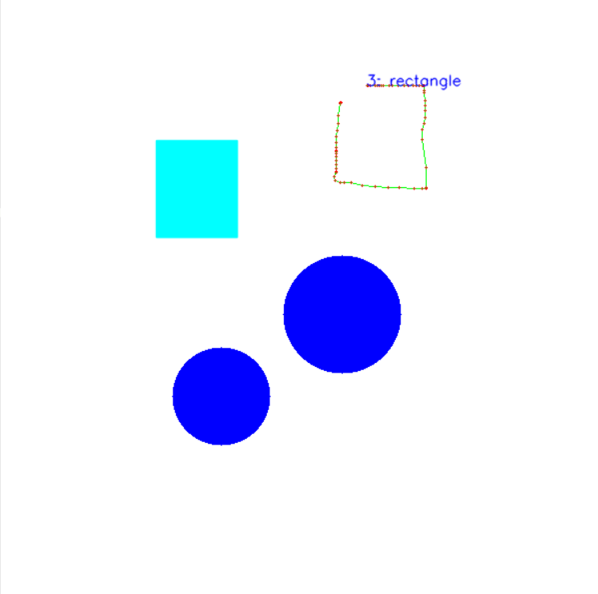

# TUIO Gesture Recognizer



## Setup

Prerequisite is to have python installed

```pip install -r requirements.txt```

## Run Client

```python client.py```

## Test Programm

Use a TUIO Simulator found at the [TUIO Website](http://tuio.org/?software).